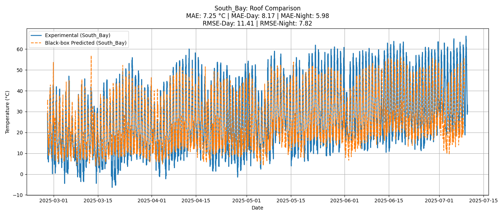
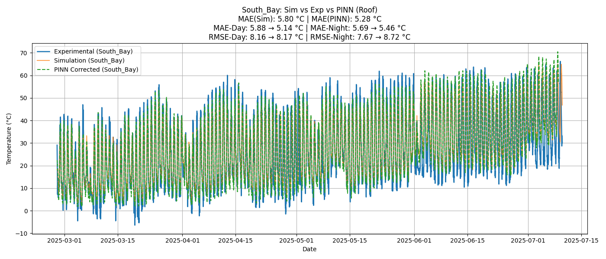

# 🏠 Physics-Guided Grey-Box Modeling for Building Thermal Performance

This repository presents a Python-based implementation of **RC thermal network modeling** for building envelope simulation, integrated with **data-driven optimization (PSO)** and **Physics-Informed Neural Networks (PINNs)**. The code is validated using experimental sensor data from ASU’s ULA building.

---

## 📁 Repository Contents (Ordered by Workflow)

| File                                  | Purpose                                                                 |
|---------------------------------------|-------------------------------------------------------------------------|
| `AZmet_Data_extraction.py`            | Extracts and processes AZMET weather data (GHI, wind, humidity)        |
| `EXP_DATA_exp.py`                     | Loads and filters experimental zone temperature data                   |
| `RC_bounds_calc.py`                   | Calculates realistic R/C bounds from geometry + material properties    |
| `WEATHER_PLOT_benchmark.py`           | Plots benchmark weather vs temperature trends                          |
| `Updated_sobol_sensitivity_prof.py`   | Performs Sobol sensitivity analysis on RC parameters                   |
| `Cold_month_PSO.py`                   | RC model optimization for **cold season** (Oct 15 – Feb 27)            |
| `Hot_month_PSO.py`                    | RC model optimization for **hot season** (Feb 27 – July 10)            |
| `Cold_month_PINN.py`                  | PINN-based residual correction for cold season                         |
| `Hot_month_PINN.py`                   | PINN-based correction for hot season                                   |
| `Black_box_model.py`                  | Data-driven model (non-physical) for comparison with RC and PINN       |

---

## 🚀 Features

- RC network grey-box simulation of building envelope
- PSO-based calibration for hot/cold seasonal data
- PINN-based correction of model residuals using PyTorch
- Sensitivity analysis via Sobol indices
- Modular preprocessing of weather + thermocouple data

---

## 🧪 Experimental Setup

- **Test Site**: ASU ULA Building – South Bay & Middle Bay
- **Zones Modeled**: Roof,  Ceiling, zone air
- **Weather Inputs**: AZMET GHI, wind speed, relative humidity
- **Temperature Sensors**: EnKoat MicroRx thermocouples
- **Data Period**: Oct 15, 2024 – July 10, 2025  
  - ❄️ **Cold Season**: Oct 15 – Feb 27  
  - 🔥 **Hot Season**: Feb 27 – July 10

---

## 📊 Simulation Results

To visualize performance, this repo includes result plots and metrics stored in a subfolder:

---

## 📈 Roof Zone Performance – Error Evolution

This section highlights the improvement in roof zone accuracy from the initial black-box baseline to the final Physics-Informed Neural Network (PINN)-corrected predictions.

Each plot shows **Mean Absolute Error (MAE)** and **Root Mean Square Error (RMSE)** split by **daytime** and **nighttime** periods for the **roof temperature only**.

---

## 📈 Roof Temperature Prediction – Full Time Series Comparison

The following plots show how predictions improved from a **black-box baseline model** to a **PINN-corrected RC simulation** for the **South Bay Roof Zone** (March–July 2025).

Each includes day vs night error breakdown (MAE, RMSE):

---

### ⚫ Baseline – Black-box Model vs Experimental

---

### ⚗️ Final – PINN-Corrected RC Model vs Experimental

